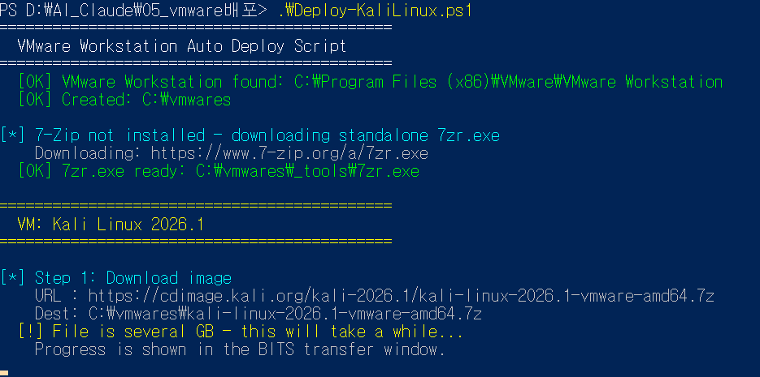
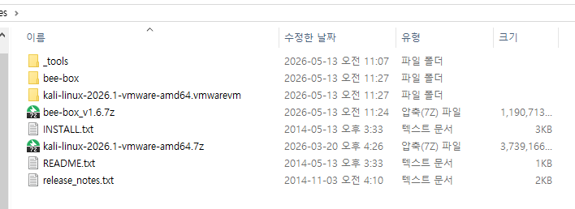
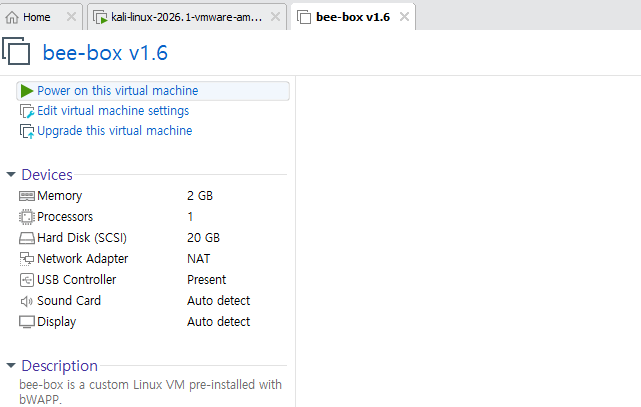

# VMware Workstation Auto Deploy Script

PowerShell script that **automatically downloads, extracts, configures, and registers** VMware virtual machines — including powering them on — with a single command.

## Included VMs

| VM | RAM | Network | Source |
|---|---|---|---|
| Kali Linux 2026.1 | 4 GB | NAT | [kali.org](https://cdimage.kali.org/) |
| bWAPP bee-box v1.6 | 2 GB | NAT | [SourceForge](https://sourceforge.net/projects/bwapp/) |

## Prerequisites

| Requirement | Notes |
|---|---|
| Windows 10 / 11 | `curl.exe` must be available (built-in since Win 10 1803) |
| VMware Workstation | Tested with VMware Workstation Pro |
| Administrator PowerShell | Required to create `C:\vmwares` and register VMs |

7-Zip is **not required** — the script downloads `7zr.exe` automatically if 7-Zip is not installed.

## Quick Start

```powershell
# 1. Open PowerShell as Administrator
# 2. Allow script execution for this session
Set-ExecutionPolicy -Scope Process -ExecutionPolicy Bypass

# 3. Run the script
.\Deploy-KaliLinux.ps1
```

## What the Script Does

For each VM in the `$VMs` list, it runs the following pipeline:

```
Step 1  Download    BITS (direct URLs) or curl -L (SourceForge redirects)
Step 2  Extract     7-Zip with -mmt=on (all CPU threads)
Step 3  Configure   Patch .vmx: memsize, ethernet0.connectionType
Step 4  Register    vmrun registerVM
Step 5  Power On    vmrun start <vmx> gui   (if AutoStart = $true)
```

Each step is **idempotent** — re-running the script skips steps that are already complete (file already downloaded, folder already extracted, etc.).

## Screenshots

### Script Execution



*VMware Workstation detected, `C:\vmwares` created, 7zr.exe downloaded, Kali download starting.*

### Extracted VM Files



*Both VMs extracted to `C:\vmwares` — Kali Linux (`.vmwarevm`) and bee-box folders visible.*

### VMware Workstation — bee-box Registered



*bee-box v1.6 registered and ready: 2 GB RAM, NAT network, pre-installed with bWAPP.*

## Adding More VMs

Edit the `$VMs` array at the top of `Deploy-KaliLinux.ps1`:

```powershell
$VMs = @(
    @{
        Name            = "My VM"
        Url             = "https://example.com/myvm.7z"
        Archive         = "myvm.7z"
        ExtractedFolder = "myvm"      # folder name after extraction
        Memory          = 2048        # MB
        Network         = "nat"       # nat | bridged | host-only
        AutoStart       = $true       # power on after registration
        Downloader      = "BITS"      # BITS (direct) | Curl (SourceForge/redirects)
    }
)
```

### Downloader Options

| Value | Tool | When to Use |
|---|---|---|
| `"BITS"` | `Start-BitsTransfer` | Direct download URLs (supports resume) |
| `"Curl"` | `curl.exe -L` | SourceForge or multi-hop redirect URLs |

## File Layout

```
C:\vmwares\
├── _tools\
│   └── 7zr.exe                          # auto-downloaded if 7-Zip not installed
├── kali-linux-2026.1-vmware-amd64.7z    # downloaded archive
├── kali-linux-2026.1-vmware-amd64.vmwarevm\
│   └── *.vmx                            # configured and registered
├── bee-box_v1.6.7z
└── bee-box\
    └── *.vmx
```

## License

MIT
